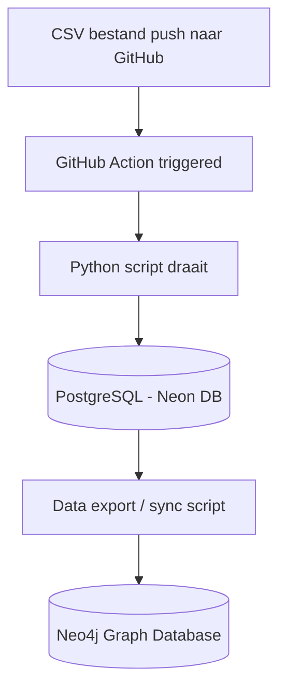

```mermaid
flowchart TD
    A[CSV bestand push naar GitHub] --> B[GitHub Action triggered]
    B --> C[Python script draait]
    C --> D[(PostgreSQL - Neon DB)]
    D --> E[Data export / sync script]
    E --> F[(Neo4j Graph Database)]
```
