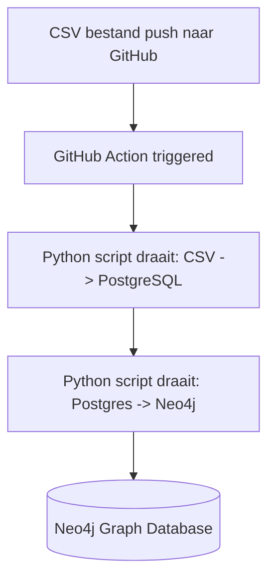

```mermaid
flowchart TD
    A[CSV bestand push naar GitHub] --> B[GitHub Action triggered]
    B --> C[Python script draait: CSV -> PostgreSQL]
    C --> D[Python script draait: Postgres -> Neo4j]
    D --> E[(Neo4j Graph Database)]

```
