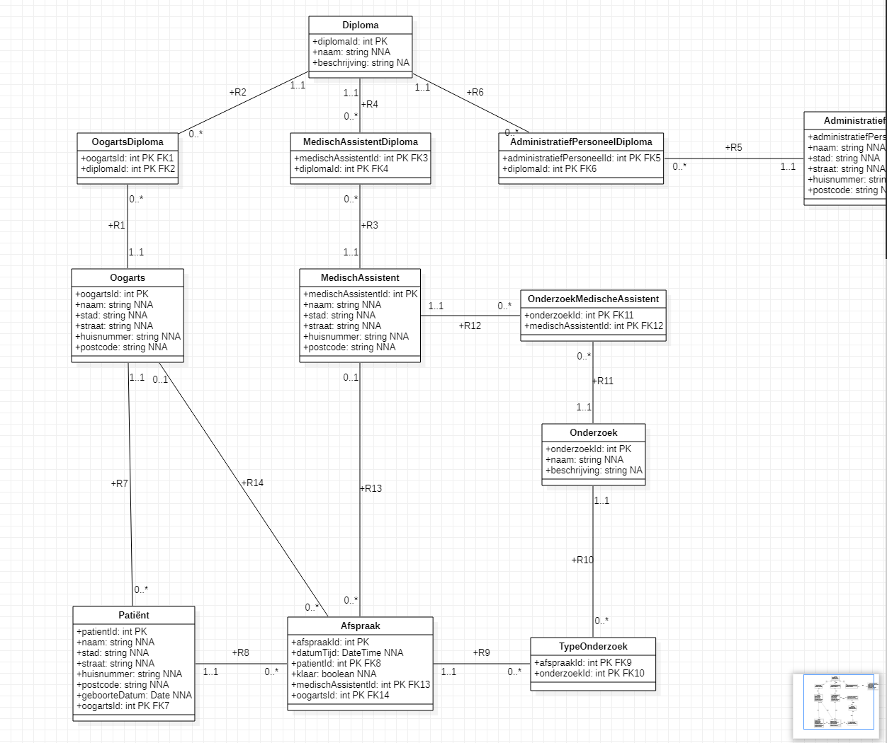
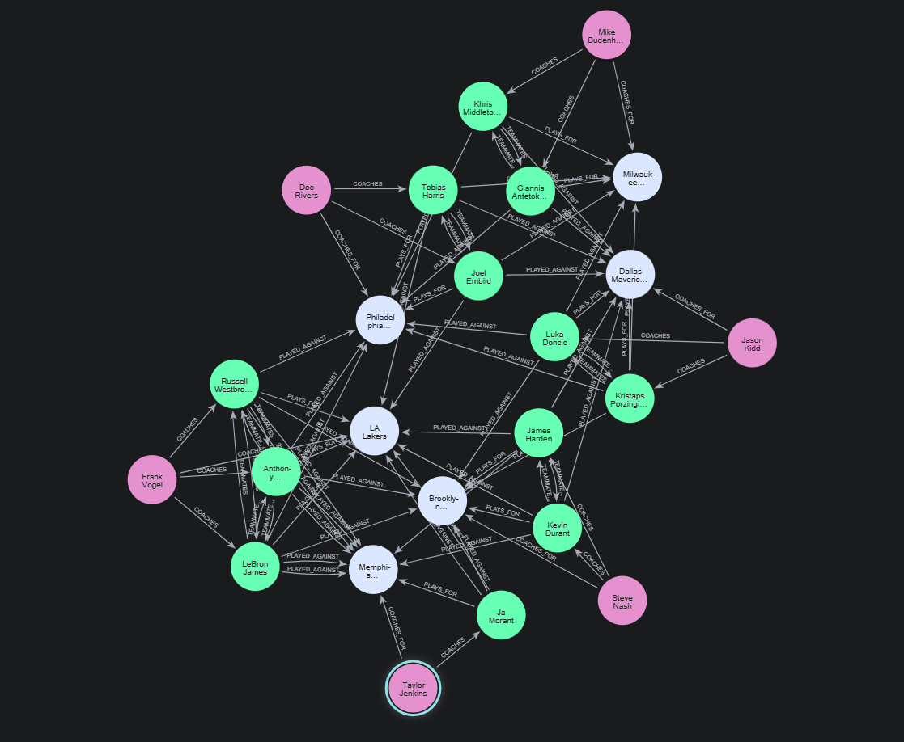
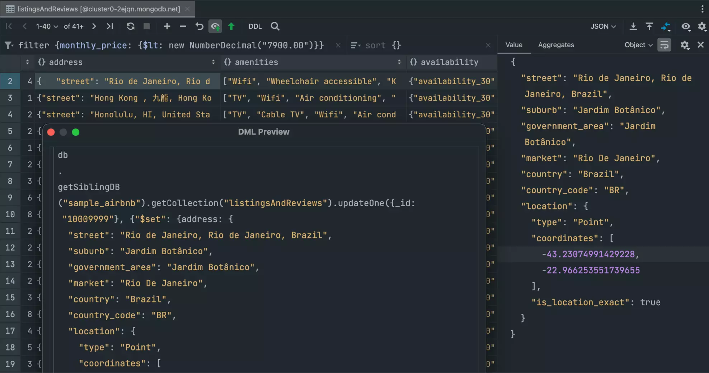
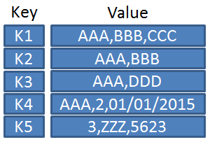
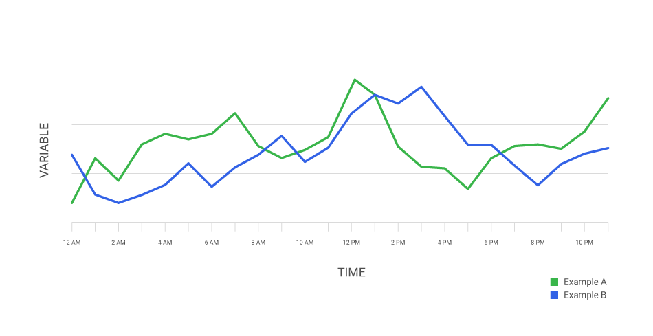
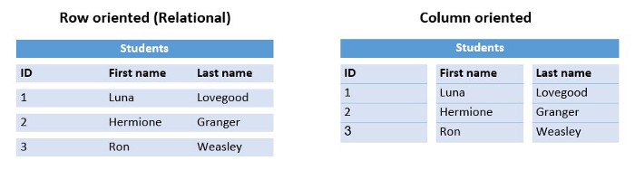

# *MOBI - 027* Database Design  
## Database Types Analyses  

## Relational Databases (SQL)  
Een relationele database is opgebouwd volgens het **relationele model**.  
- Gegevens worden opgeslagen in **tabellen**, waarbij alle rijen in een tabel soortgelijke informatie bevatten.  
- Tabellen kunnen aan elkaar gekoppeld worden via een **kolom met een verwijzing** (foreign key) naar een record uit een andere tabel.  
- Gegevens worden opgeslagen, opgehaald en gewijzigd met behulp van een **RDBMS** (Relational Database Management System).  
- Hiervoor wordt meestal de gestandaardiseerde taal **SQL** gebruikt.  

### ✅ Voordelen  

#### 1. Gegevensconsistentie en -integriteit  
- Gebruik van **primary keys, foreign keys, unique constraints** en **check constraints**.  
- Zorgt ervoor dat data correct blijft (bv. geen bestelling zonder klant).  
- Vermindert kans op foutieve of dubbele data.  

#### 2. Flexibele query’s met SQL  
- SQL maakt eenvoudige en complexe zoekopdrachten mogelijk (joins, subqueries).  
- Ondersteunt aggregaties, rapportages en data-analyse.  
- Geeft gebruikers en ontwikkelaars veel vrijheid.  

#### 3. Beveiliging  
- Toegangscontrole per **gebruiker of rol**.  
- Enkel geautoriseerde personen kunnen gevoelige data zien of wijzigen.  
- Ondersteunt **encryptie** (data-at-rest & data-in-transit).  

#### 4. Breed ondersteund  
- RDBMS is stabiel en volwassen door decennia van gebruik.  
- Ondersteuning in vrijwel alle programmeertalen en frameworks.  
- Uitgebreide documentatie, community en professionele support.  
- Bekende systemen: **MySQL, PostgreSQL, Oracle, SQL Server**.  

#### 5. Normalisatie  
- Data wordt efficiënt opgeslagen door tabellen logisch te splitsen.  
- **Beperkt duplicatie** en verhoogt consistentie.  
- Eenvoudiger onderhoud: wijziging gebeurt op één plek.  

### ❌ Nadelen  

#### 1. Schaalbaarheid  
- Ontworpen voor **verticale schaalbaarheid** (krachtigere hardware).  
- Horizontale schaal (meerdere servers) is complex door afhankelijkheden.  
- Minder geschikt voor wereldwijd verdeelde systemen met miljoenen gebruikers.  

#### 2. Complexiteit van schema’s  
- Sterk genormaliseerde schema’s kunnen leiden tot veel tabellen.  
- Queries vereisen vaak **meerdere joins**, wat traag of complex kan zijn.  
- Slecht ontworpen schema’s maken systemen log en moeilijk onderhoudbaar.  

#### 3. Prestaties bij grote datasets  
- Zeer grote tabellen of veel transacties kunnen leiden tot vertraging.  
- Complexe queries en joins worden traag bij miljarden records.  
- Indexen helpen, maar kosten extra opslag en onderhoud.  
- Voor **Big Data** worden vaak NoSQL- of gespecialiseerde systemen gebruikt.  

#### 4. Rigide structuur  
- Vereist een vooraf gedefinieerd **schema**.  
- Aanpassingen (extra velden, structuurwijzigingen) zijn omslachtig.  
- Minder flexibel dan **schema-loze NoSQL-systemen**.  

### 📊 Visualisatie  
  

---

## Graph Databases  
Een graph database is een database die de graph structuur gebruikt voor sematische query's met nodes, edges en properties om data voor te stellen en op te slaan. De graph verbindt de gegevens in de database via een verzameling van nodes en verbindingen, waarbi jdie verbindingen de relaties tussen de nodes voorstellen. 
Die relaties zorgen ervoor dat de gegevens in de database direct met elkaar gelinkt kunnen worden en in veel gevallen met 1 bewerking opgehaald kunnen worden. Relaties staan centraal in dit soort databases. Het ophalen van verschillende relaties gaat snel omdat deze ook permanent in de database worden bewaard. Graph databases maken relaties ook **intuïtief visualiseerbaar**

### ✅ Voordelen  
#### 1. Snelle verwerking van relaties
- Graph databases zijn geoptimaliseerd om realties (edges) tussen data snel te doorzoeken
- Dit maakt ze ideaal voor toepassingen waar de verbanden belangrijker zijn dan de losse gegevens

#### 2. Flexibel datamodel (schema-loos)
- Data kan zonder rigide schema worden toegevoegd
- Nieuwe nodes of realties kunnen eenvoudig worden ingevoerd zonder dat bestaande structuren aangepast moeten worden
- Dit maakt het makkelijk om met veranderende of ongestructureerde data te werken

#### 3. Complexe query's zijn eenvoudiger
- Relaties die in realtionele databases veel joins vereisen, zijn in graph databases veel directer en sneller op te vragen
- Met querytalen zoals **Cypher** (Neo4j) kun je patronen in netwerken eenvoudgi uitdrukken.

#### 4. Schaalbaarheid in graphs
- Zijn zeer efficiënt bij zeer verbonden data (many-to-many relaties), iets waar relationele databases vaak moeite mee hebben.

#### 5. Sterk bij specfieke use-cases
- Perfect voor toepassingen als **fraudedetectie, aanbevelingssystemen, routebepaling, kennisgrafen en sociale netwerken**

### ❌ Nadelen
#### 1. Beperkte standaardisatie
- Relationele databases hebben SQL als standaard, maar graph databases hebben verschillende querytalen (vb: Cypher, Gremlin, SPARQL)
- Dit maakt overstappen tussen systemen lastiger

#### 2. Minder volwassen ecosysteem
- Relationele databases bestaan al tientallen jaren, graph databases zijn relatief nieuw.
- Er is minder tooling, documentatie en community-ondersteuning, hoewel dit wel groeit.

#### 3. Prestaties bij niet-grafische data
- Voor datasets zonder veel realties (vb: finaiciële transacties, simpele tabellen) zijn graph databases

#### 4. Complexiteit van beheer
- Het ontwerpen van een goed graph-model vergt ervaring en is vaak minder intuïtief dan tabellen in een relationele database
- Schalen over meerdere servers is mogelijk, maar vaak complexer dan bij NoSQL-oplossingen zoals document- of key-value stores

#### 5. Kosten/licenties
- Populaire graph databases zoals **Neo4j** hebben gratis community-edities, maar enterprise-versies met geavanceerde features kunnen duur zijn.

### 📊 Visualisatie 

  

---

## Document Databases (NoSQL)  

Een document database is een type NoSQL-database die data opslaat in documenten in plaats van in traditionele tabellen zoals gebeurt bij relationele databases. Deze documenten zijn meestal JSON-, BSON- of XML-gebaseerd en kunnen zowel gestructureerde als semi-gestructureerde data bevatten. Elk document is een zelfstandige eenheid en kan verschillende velden en datatypes bevatten.  

Document databases slaan data op in **collecties**, die vergelijkbaar zijn met tabellen, maar veel flexibeler zijn. Documenten binnen een collectie hoeven niet hetzelfde schema te volgen; sommige velden kunnen ontbreken of juist extra velden bevatten. Bijvoorbeeld: een gebruiker kan samen met al zijn bestellingen in 1 document worden opgeslagen, waarbij elk document alle relevante informatie bevat.
 

Zoekopdrachten binnen doucment databases kunnen op velden binnen documenten worden uitgevoerd. Indexen kunnen worden toegeveogd om deze zoekopdrachten te versnellen. Relaties tussen dat aworden vaak genest binnen een document of gelegd via referenties naar andere documenten, waardoor veel data direct in 1 doucment kan worden opgehaald zonder complexe joins.
 

Document databases zijn ontworpen voor **horizontale schaalbaarheid**, waardoor grote datasets automatisch over meerdere servers verdeeld kunnen worden (sharding). Dit maakt ze zeer geschikt voor applieties met veel gebruikers en snel veranderende data. Dankzij het **flexibele schema** kunnen nieuwe velden of datatypes eenvoudig worden toegevoegd zonder bestaande data aan te passen, wat ontwikkeling en iteratie versnelt.
 

Kortom, document databases werken met zelfstandige, flexibele documenten die makkelijk ongestructureerde of semi-gestructureerde data kunnen opslaan, snel schaalbaar zijn en efficiënte toegang tot data en relaties beiden.

### ✅ Voordelen 
#### 1. Flexibel schema (schema-loos)
- Document databaese zoals MongoDB slaan data op in JSON-achtige documenten.
- Elk document kan een andere strcutuur hebben, waardoor je eenvoudig nieuwe velden kunt toeveogen zonder bestaande data te wijzigen.
#### 2. Eenvoudige opslag van complexe data
- Gegevens die normaal verdeeld zouden worden over meerdere tabellen in een relationele database, kunnen in 1 doucment worden opgeslagen
- Bijvoorbeeld: een gebruiker en al zijn bestellingen kunnen in 1 JSON-document zitten
#### 3. Schaalbaarheid
- Document datbases zijn ontworpen voor horizontale schaalbaarheid (sharding), wat betekend dat data over meerdere servers kan worden verdeeld.
- Dit maakt ze geschikt voor grote datasets en veel gelijktijdige gebruikers.
#### 4. Snelle ontwikkeling
- Omdat er geen rigide schema is, kunnen ontwikkelaars snel itereren en applicaties bouwen zonder steeds schemawijzigingen door te voeren.
#### 5. Geschikt voor ongestructureerde data
- Document databases zijn ideaal voor applicaties met dynamische of ongestructureerde data, zoals contentmanagementsystemen, logbastanden of IoT-data.

### ❌ Nadelen
#### 1. Minder dataconsistentie
- Veel document databases bieden **eventual consistency** in plaats van sterke ACID-transacties.
- Dit kan leiden tot tijdelijke inconsistenties bij gelijktijdige updates.

#### 2. Complexere query's bij relaties
- Relaties tussen documenten zijn niet direct ingebouwd zoals in realtionele databases.
- Voor complexe verbanden zijn extra query's of duplicatie van data nodig, wat inefficiënt kan zijn.

#### 3. Beperkte transactiemogelijkheiden
- Hoewel sommige moderne systemen transacties onderstuenen, is dit vaak minder krachtig dan in relationele databases.
- Multi-doucment transacties zijn vaak trager en ingewikkelder.

#### 4. Minder volwassen ecosysteem
- Document databases zijn relatief jonger dan relationele datbases, dus er is soms minder tooling, ondersteuning en standaardisatie.

#### 5. Indexering en prestaties
- Zonder goede indexering kunnen queries traag worden.
- Het ontwerpen van efficiënte indexen vereist kennis van de specifieke database en het datamodel.

### 📊 Visualisatie 
 

---

## Key-Value Stores  
Een **key-value stores** is een type NoSQL-datbase waarin data wordt opgeslagen als een verzameling van **key-value paren**. Elke key is uniek en verwijst naar een specifieke value, die eenvoudig of complex kan zijn, zoals een string, JSON-object of binair bestand. In een key-value store staat de sleutel centraal en fungeert als directe toegang tot de bijbehorende waarde.
 

Deze databases zijn extreem eenvoudig en efficiënt bij het ophalen van data: als je de key weet, kan de value in **constante tijd** worden opgehaald, ongeacht de grootte van de dataset. Key-value stores zijn daardoor zeer geschikt voor toepassingen die snelle toegang tot specifieke items vereisen, zoals caching, sessiebeheer of real-time analytics.
 

Key-value stores zijn vaak **schema-loos**: er is geen voorafgedefinieerd schema nodig. Hierdoor kunnen data en structuur flexibel veranderen zonder dat de database aangepast hoeft te worden. Daarnaast zijn ze ontworpen voor **horizontale schaalbaarheid**, waardoor grote heoveelheden data over meerdere servers kunnen worden verdeeld (sharding)

### ✅ Voordelen

#### 1. Snelheid
- Key-value stores beiden extreem snelle toegang tot data.
- Als je de sleutel kent, kun je de waarde direct ophalen in constante tijd, zelfs bij enorme datasets.
- Hierdoor ideaal voor toepassingen zoals caching of sessiebeheer.

#### 2. Schaalbaarheid
- Ze zijn ontworpen voor horizontale schaalbaarheid.
- Data kan eenvoudig verdeeld owrden over meerdere servers (sharding), waardoor ze geschikt zijn voor big data en gedistribueerde systemen.

#### 3. Flexibiliteit
- Er is geen schema nodig
- De waarde kan van alles zijn: een string, JSON, binair bestand, enzovoort. Dit maakt het mogelijk om snel nieuwe soorten data op te slaan zonder databasewijzigingen.

#### 4. Eenvoud
- Datamodel (key --> value) is eenvoudig en gemakkelijke te begrijpen.
- Dit vereenvoudigt beheer, implementatie en onderhoud.

### ❌ Nadelen

#### 1. Beperkte querymogelijkheden
- Je kunt alleen efficiënt zoeken op de key.
- Zoeken of filteren op waarden is vaak niet mogelijk of er traag.

#### 2. Geen ondersteuning voor relaties
- Elke key-value is geïsoleerd.
- Relaties tussen data moeten door de applicatielogica zelf worden beheerd, wat extra complexiteit kan opleveren.

#### 3. Minder gechikt voor analyses
- Voor complexe queries, aggregaties of joins zijn key-value stores niet geschikt.
- Daarvoor zijn realtionele of document databases beter

#### 4. Beperkte standaardisatie
- Elke key-value store heeft vaak zijn eigen API of querymechanisme.
- Beperkt de overdraagbeerheid van applciaties tussen verschillende systemen.

### 📊 Visualisatie 
 

---

## Time-Series Databases
Een **time-series database (TSDB)** is een type database dat speciaal is ontworpen voor het opslaan, verwerken en analyseren van tijdsreeksen: data die in de tijd word verzameld en gelogd. Elke invoer bestaat uit een **tijdstempel** en 1 of meer waarden die daarbij horen. Denk hierbij aan metingen van sensoren, financiële marktdata, serverlogs of monitoringgegevens van applicaties.
 

Het belangrijkste kenmerk van time-series databases is dat de **tijd het primaire organisatieprincipe** van de data is? Dit maakt ze geoptimaliseerd voor het opslaan van enorme hoeveelheden opeenvolgende metingen die vaak continu en in hoog tempo worden teogevoegd.
 

Time-series databases gebruiken technieken zoals **compressie** en **retentie policies** om de opslag efficiënt te houden, omdat de hoeveelehid data snel kan groeien. Daarnaast zijn ze vaak voorzien van functies om **aggregaties en berekeningen over tijdsintervallen** (zoals gemiddelden, sommen of maximum per minuut, uur of dag) snel uit te voeren.
 

Eeen groot voordeel van TSDB's is dat ze real-time analyse onderstuenen. je kunt eenvoudig trends ontdekken, afwijkingen detecteren of historische data vergelijken met actuele gegevens. Hierdoor zijn ze zeer geschikt voor toepassingen zoals **IoT, monitoring, performance tracking, energiebeheer en financiële analyse**
 

### ✅ Voordelen
#### 1. Geoptimaliseerd voor tijdreeksen
- Time-series databases zijn speciaal ontworpen om data met tijdstempels efficiënt op te slaan en op te vragen
- In tegenstelling tot relationele databases kunnen ze beter omgaan met grote hoeveelheden opeenvolgende meetgegevens.

#### 2. Hoge schrijfsnelheid
- TSDB's zijn gebouwd om continu enorme hoeveelehden nieuwe data te verwerken.
- Ze kunnen miljoenen metingen per seconde opslaan, wat essentieel is bij toepassinge zoals IoT of servermonitoring.

#### 3. Efficiënte opslag door compressie
- Door slimme compressie-algoritmes wordt de opslagn van tijdreeksdata geoptimaliseerd.
- Dit is belangrijk omdat sensordata, logbestanden en andere metingen vaak zeer omvangrijk zijn.

#### 4. Sterke analysemogelijkheden over tijd
- TSDB's ondersteuenen berekeningen zoals gemiddelden, maximum, minimum of sommen over bepaalde intervallen
- Dit maakt ze ideaal voor trendanalyses, rapportages en anomaly detection.

#### 5. Ondersteuning voor real-time monitoring
- TSDB's maken het eenvoudig om dashboards en alerts te bouwen die real-time data verwerken.
- Dit wordt veel gebruikt in servermonitoring, netwerkbewaking en financiële markttoepassingen.

### ❌ Nadelen

#### 1. Beperkte veelzijdigheid
- TSDB's zijn gespecialiseerd in tijdreeksen en daardoor minder geschikt voor algemene relationele dat aof complexe datamodellen

#### 2. Schaalbaarheid kan complex zijn
- Hoewel horizontale schaalbaarheid vaak mogelijk is, vraagt dit om specifieke configuratie en kennis van de gekozen database.

#### 3. Minder geschikt voor ad-hoc query's buiten tijdreeksen
- Zoekopdrachten die niet tijd-gebaseerd zijn, kunnen inefficiënt of moeilijk uitvoerbaar zijn.

#### 4. Kleinere community en ecosysteem
- Vergeleken met realtionele databases of document stores is de community kleiner.
- Ook zijn er minder standaard tools, libraries en documentatie beschikbaar

### 📊 Visualisatie 
 

---

## Columnar Databases  
Een **columnar database** is een type database dat data opslaat op **kolomniveau** in plaats van op **rijniveau**, zoals bij traditionele realtionele databases. In een traditionele database worden alle velden van een record (rij) achter elkaar opgeslagen, terwijl bij een columnar database alle woorden van 1 kolom samen worden opgeslagen.
 

Deze manier van opslaan is vooral efficiënt voor **analytische workloads** waarbij vaak aggregaties en berekeningen over bepaalde kolommen worden uitgevoerd, zoals sommen, gemiddelden of maximum. Doordat kolomwaarden aaneengesloten staan opgeslagen, kan de database sneller lezen, compressie beter toepassen enminder data inlezen voor analytische query's.
 

Columnar databases worden veel gebruikt in **data warehouses, business intelligence en big data analytics**, omda tze grote datasets efficiënt kunnen verwerken en queries over miljoenen of miljarden rijen snel kunnen uitvoeren.

### ✅ Voordelen
#### 1. Snelle analytische query's
- Doordat dat aper kolom wordt opgeslagen, kunnen queries die slechts een subset van kolommen nodig hebben vele sneller worden uitgevoerd.
- Dit is ideaal voor rapportages, dashboards en big data-analyses.

#### 2. Hoge compressie
- Kolommen bevatten vaak data van hetzelfde type, waardoor compressie-algoritmes beter werken.
- Dit bespaart opslagruimte en versnelt het inlezen van grote datasets.

#### 3. Efficiënt voor aggregaties
- Berekeningen zoals sommen, gemiddelden, maximum of minimum kunnen snel worden uitgevoerd op kolommen oznder dat hele rijen hoeven te worden ingeladen.

#### 4. Schaalbaarheid
- Columnar databases zijn vaak ontworpen voor grote datasets en horizontale schaalbaarheid, waardoor ze geschikt zijn voor data warehouses en big data-toepassingen.

#### 5. Leesintensief geoptimaliseerd
- Ze zijn geoptimaliseerd voor workloads waarbij veel wordt gelezen en relatief weinig wordt geschreven.
- Dit maakt ze ideaal voor analytische toepassingen en business intelligence

### ❌ Nadelen
#### 1. Trage schijfbewerkingen
- Insert- of update-operaties zijn vaak minder efficiënt dan in traditionele rijniveau databases, vooral bij veel kleine transacties.

#### 2. Beperkt voor transactionele workloads
- Voor OLTP-toepassingen (online transaction processing) waarbij veel rijen worden toegevoegd of gewijzigd, zijn columnar databases minder geschikt.

#### 3. Complexere architectuur
- Het ontwerp van een columnar database en de optimalisatie van queries vergt vaak meer kennis dan bij traditionele relationele databases.

#### 4. Minder geschikt voor relationele integriteit
- Ondersteuning voor complexe relaties, foreign keys of constriants is vaak beperkt of minder efficiënt dan in realtionele databases

### 📊 Visualisatie 

---