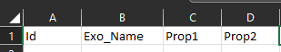
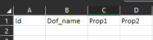
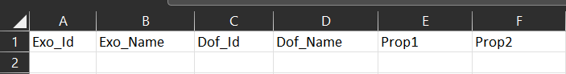
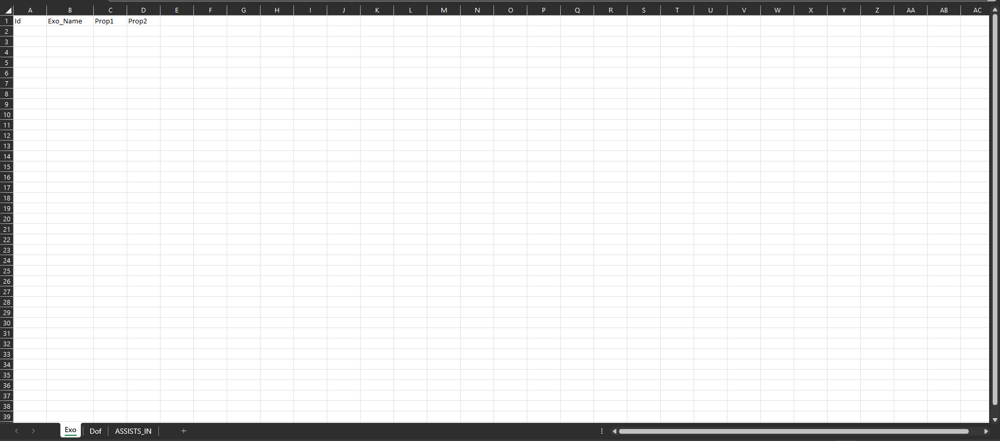

# *MOBI - 027* Database Design

## Notities meeting (02/10/2025)

### Export
Tijdens de meeting werd besproken of het mogelijk is om gegevens per **Node** of **Relatie** te exporteren, en in welk formaat dit het meest bruikbaar zou zijn. Er werd gekeken naar **JSON**, **CSV** en **Excel**
- Voorstel om een **basis export naar Excel** te voorzien (en testen)
- Export per **Node** en per **Relatie**
- Mogelijkheid om in Excel meerdere tabbladen te gebruiken (bijvoorbeeld: apart blad voor elke node en relaties tussen beide nodes)
- Extra aandacht voor de **leesbaarheid en consistentie** van de exports

### Import
Er werd besproken of de huidige **CSV-bestanden** voor importeren eenvoudig genoeg zijn of dat er verbetering mogelijk zijn. Een aantal suggesties kwamen naar voren:
- Het gebruik van **één Excel-bestand** met meerdere tabbladen, bv:
- - Tabblad 1: **Exos**
- - Tabblad 2: **Dofs**
- - Tabblad 3: **Relaties** tussen beide
- In de Relaties-tab kan men kiezen of enkel de **IDs** bewaard worden of ook de namen van de gekoppelde entiteiten (**dof** en **exo**).
- Bij ontbrekende waarden:
- - Optie 1: leeg laten
- - Optie 2: werken met een standaardwaarde zoals "**NVT**" (voordeel: in de toekomst kan men ook filteren/zoeken op "NVT").

### Structuur & Gebruiksvriendelijkheid
- Doel: een **duidelijke en overzichtelijke Excel** die zowel eenvoudig te exporteren als te importeren is
- Voorbeeldstructuur ward overlopen (met **Exo, Dof** en hun Relaties)
- Blangrijk dat zowel iedereen vlot met de bestanden kunnen werken

##### Exo Page example
  
##### Dof Page Example
  
##### Relation Page Example
  
##### All Pages Overview Example
  
##### Full Excel Overview Example
  
