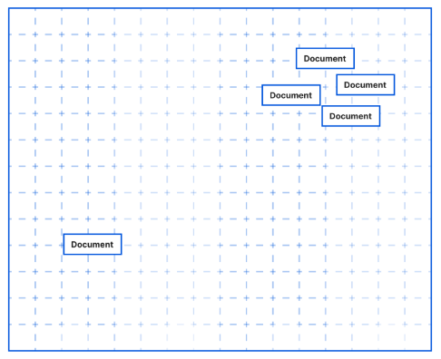

# Research Vector Database

## Wat is een vector database?
Vector datbase is een collectie van data bewaard als mathematische representaties. Vector databases maken het eenvoudiger voor machine learning modellen om vorige inputs te onthouden wat machine learning in staat steld om gebruik te maken van power search, aanbevelingen en tekst gegenereerde use-cases. Data kan geïdentificeerd worden op basis van overeenkomende metrics in plaats van exacte matches wat het mogelijk maakt voor computer modelen om de data contextueel te begrijpen.

Om samen te vatten, vector databases maken het mogelijk voor computer programma's om vergelijkingen te maken, identificeren van relaties en begrijpen van de context. Dit stelt het maken van uigebreide AI programmas zoals LLMs mogelijk.

## Wat is een vector
Een vector is een array van numerieke waardes die de locatie van een floating pint voorstellen over verschillende dimensies. In meer alledaagse taal, een vector is ene lijst van nummers zoals: {12, 13, 19, 8, 9}. deze nummers wijzen naar de locatie in de ruimte, net zoals B7 een rij en kollom voorstellen in een spreadsheet.

## Hoe werken verctor databases?
Elke vector in een bector database komt overeen met een object of item, dit kan een woord, afbeelding, video, film, document en eender welk ander type data zijn. Deze vectoren zijn waarschijnlijk lang en complex, en drukken de locatie van elk object uit langs tientallen of zelfs honderden dimensies.

Bijvoorbeeld, een vector database van films kan mogelijks films localiseren over dimensies zoals hoe lang de film duurt, het genre, het jaar dat de film is uitgebracht, pg rating, aantal acteurs, aantal view en zo voort. Als deze vectors accuraat worden gemaakt, zullen meer overeenkomende films eerder samen geclusterd zijn in de vector database.

## Hoe worden vector databases gebruikt?
**Overeenkomsten- en sematische zoekopdrachten:**
Vector databases stellen toepassingen in staat om relevante items met elkaar te verbinden. Vectoren die dicht bij elkaar gegroepeerd zijn, lijken op elkaar en zijn waarhscijnlijk daardoor ook relevanter voor elkaar. Dit helpt gebruikers bij het zoeken naar relavante informatie (vb: een zoekopdracht naar afbeeldingen), maar het helpt toepassingen ook om:
* Vergelijkbare producten aan te bevelen
* Liedjes, films of series voor te stellen
* Afbeeldingen of video's voor te stellen

**Machine learninge en deep learning:**
De mogelijkheid om relevante informatie-items met elkaar te verbinden maakt het mogelijk om machine learning- (en deep learning-)modellen te bouwen die complexe cognitieve taken kunnen uitvoeren.

**Grote taalmodellen (LLMs) en generatieve AI**
LLMs, zoals die waarop CHatGPT zijn gebaseerd, vertrouwen op de contextuele analyse van tekst die mogelijk wordt gemaakt door vector-databases. Door woorden, zinnen en ideeën met elkaar te associëren, kunnen LLMs natuurlijke menselijke taal begrijpen en zelfs tekst genereren.

## Wat zijn embeddings?
Embeddings zijn vectoren die door nuerale netwerken worden gegenereerd. Een typische vector-database voor een deep learning-model bestaat uit embeddings. Zodra een neuraal netwerk goed is fijn afgestemd, kan het zelf embeddings genereren, zodat ze niet handmatig hoeven te worden aangemaakt. Deze embeddings kunnen vervolgens worden gebruik voor overeenkomstige zoekopdrachten, contextuele analyse, generatieve AI en meer.

## Wat zijn de voordelen van het gebruik van een vector-database?
Het opvragen van een machine learning-model op zichzelf, zonder een vector-database, is noch snel, noch kosteneffectief. Machine learning-modellen kunnen niets onthouden buiten wat ze tijdens de training hebben geleerd. Ze hebben elke keer de volledige context nodig (zoals veel eenvoudige chatbots werken).

Het steeds opnieuw doorgeven van de context van een query aan het model is er traag, omdat dit waarschijnlijk veel data omvat, en boevendien duur, omdat data moet worden verplaatst en rekenkracht telkens opnieuw moet worden gebruikt om het model dezelfde data te laten verwerken. In de praktijk zijn de meeste machine learning-API's bovendien beperkt in hoeveel data ze tegelijk kunnen verwerken.

Hier komt een vector database van pas: een dataset wordt slechts één keer (of periodiek bij veranderingen) door het model verwerkt, en de embeddings van die data worden opgeslagen in de vector database.

Dit bespaart enorm veel rekentijd. Het maakt het mogelijk om gebruikersgerichte toepassingen te bouwen rond sematisch zoeken, classificatie en anomaliedetectie, omdat de resultaten binnen enkele tientallen milliseconden terugkomen, zonder te wachten tot het model de hele dataset heeft verwerkt.

Voor queries vragen ontwikkelaars het machine learning-model om een representatie (embedding) van alleen die specifieke query. Deze embedding kan vervolgens naar de vector-database worden gestuurd, die vergelijkbare embeddings kan teruggeven, embeddings die al eerder door het model zijn verwerkt. die embeddings kunnen dan weer worden gekoppeld aan hun oorspronkelijke inhoud: of het nu een URL van een pagina, een link naar een afbeelding of product-SKU's is.

**Samengevat:** Vector databases werken op schaal, zijn snel en kosteneffectiever dan het direct opvragen van machine learning-modellen zonder hen.